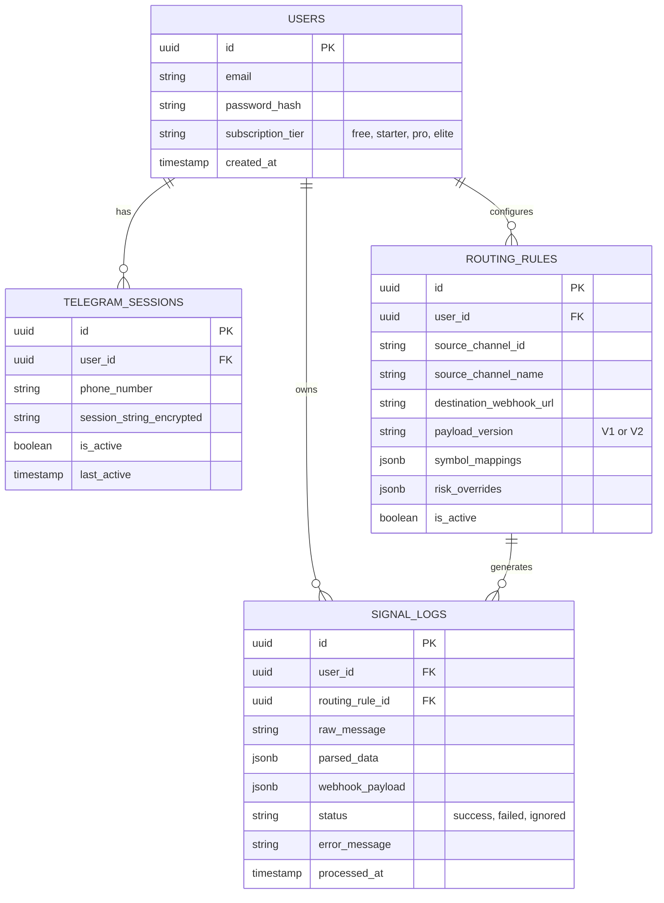

# Database Schema Design

**Database Provider**: Neon (Serverless PostgreSQL). The database scales to zero when idle and resumes in ~500ms. All standard PostgreSQL features (JSONB, UUID, indexes) are fully supported.

## 1. Entity-Relationship Diagram



## 2. SQL Table Definitions

### `users`
Stores user account information for the dashboard.

```sql
CREATE TABLE users (
    id UUID PRIMARY KEY DEFAULT gen_random_uuid(),
    email VARCHAR(255) UNIQUE NOT NULL,
    password_hash VARCHAR(255) NOT NULL,
    created_at TIMESTAMP WITH TIME ZONE DEFAULT CURRENT_TIMESTAMP,
    updated_at TIMESTAMP WITH TIME ZONE DEFAULT CURRENT_TIMESTAMP
);
```

### `telegram_sessions`
Stores the encrypted MTProto session strings required to connect to Telegram on behalf of the user.

```sql
CREATE TABLE telegram_sessions (
    id UUID PRIMARY KEY DEFAULT gen_random_uuid(),
    user_id UUID NOT NULL REFERENCES users(id) ON DELETE CASCADE,
    phone_number VARCHAR(50) NOT NULL,
    session_string_encrypted TEXT NOT NULL,
    is_active BOOLEAN DEFAULT TRUE,
    last_active TIMESTAMP WITH TIME ZONE,
    created_at TIMESTAMP WITH TIME ZONE DEFAULT CURRENT_TIMESTAMP,
    updated_at TIMESTAMP WITH TIME ZONE DEFAULT CURRENT_TIMESTAMP,
    UNIQUE(user_id, phone_number)
);
```

### `routing_rules`
Stores the user's multi-destination routing configurations. A single `source_channel_id` can have multiple rows (destinations).

```sql
CREATE TABLE routing_rules (
    id UUID PRIMARY KEY DEFAULT gen_random_uuid(),
    user_id UUID NOT NULL REFERENCES users(id) ON DELETE CASCADE,
    source_channel_id VARCHAR(255) NOT NULL,
    source_channel_name VARCHAR(255),
    destination_webhook_url TEXT NOT NULL,
    payload_version VARCHAR(10) NOT NULL CHECK (payload_version IN ('V1', 'V2')),
    symbol_mappings JSONB DEFAULT '{}'::jsonb,
    risk_overrides JSONB DEFAULT '{}'::jsonb,
    is_active BOOLEAN DEFAULT TRUE,
    created_at TIMESTAMP WITH TIME ZONE DEFAULT CURRENT_TIMESTAMP,
    updated_at TIMESTAMP WITH TIME ZONE DEFAULT CURRENT_TIMESTAMP
    -- Note: Removed UNIQUE(user_id, channel_id) to allow multi-destination routing
);
```

### `signal_logs`
Records every signal processed by the system for auditing and troubleshooting.

```sql
CREATE TABLE signal_logs (
    id UUID PRIMARY KEY DEFAULT gen_random_uuid(),
    user_id UUID NOT NULL REFERENCES users(id) ON DELETE CASCADE,
    routing_rule_id UUID REFERENCES routing_rules(id) ON DELETE SET NULL,
    raw_message TEXT NOT NULL,
    parsed_data JSONB,
    webhook_payload JSONB,
    status VARCHAR(50) NOT NULL CHECK (status IN ('success', 'failed', 'ignored')),
    error_message TEXT,
    processed_at TIMESTAMP WITH TIME ZONE DEFAULT CURRENT_TIMESTAMP
);
```

## 3. Indexing Strategy

To ensure fast retrieval during real-time signal processing, the following indexes should be created:

```sql
-- Fast lookup of active sessions for the listener
CREATE INDEX idx_telegram_sessions_active ON telegram_sessions(is_active);

-- Fast lookup of routing rules when a message arrives from a specific channel
CREATE INDEX idx_routing_rules_lookup ON routing_rules(user_id, source_channel_id) WHERE is_active = TRUE;

-- Fast retrieval of logs for the user dashboard
CREATE INDEX idx_signal_logs_user_date ON signal_logs(user_id, processed_at DESC);
```
